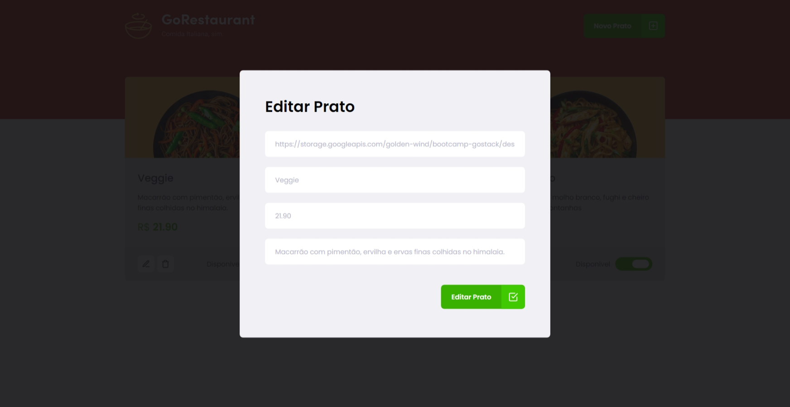

## Desafio: Site de Restaurante de Comida Italiana (Go restaurante)

Neste desafio, o objetivo foi transformar os componentes de classes existentes em componentes funcionais utilizando o TypeScript. Para isso, foi necessário reescrever os componentes de classe para componentes funcionais, utilizando hooks do React, como `useState` e `useEffect`. Além disso, foi preciso adicionar tipagem com TypeScript para garantir a segurança e consistência dos tipos de dados utilizados no código. 


## Rodando localmente

Clone o projeto

```bash
  git clone https://github.com/IsraelBarbosa/ignite-reactjs-refactoring-classes-ts.git
```

Entre no diretório do projeto

```bash
  cd ignite-reactjs-refactoring-classes-ts
```

Instale as dependências

```bash
  yarn
```

Inicie o json-server

```bash
  yarn server
```

Inicie o servidor

```bash
  yarn start
```


## Stack utilizada

* React
* TypeScript
* styled-components


## Aprendizados

* React com typeScript
* Utilizar o react-router-dom
* Utilizar o axios
* Api mocking com o json-server
* Utilizar o Styled-components


## Funcionalidades

O projeto oferece as seguintes funcionalidades:

- Adicionar um novo prato
- Editar um prato existente
- Excluir um prato
- Definir a disponibilidade de um prato


## Screenshots


